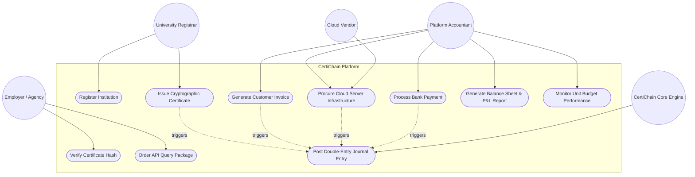
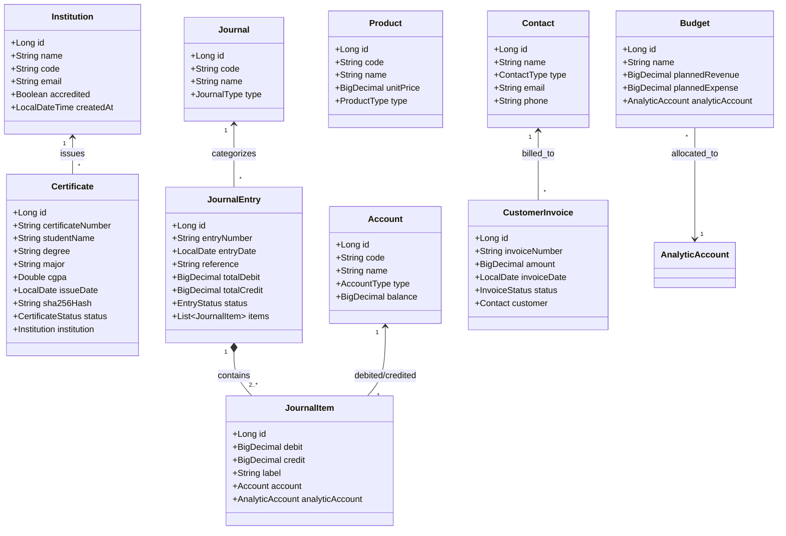
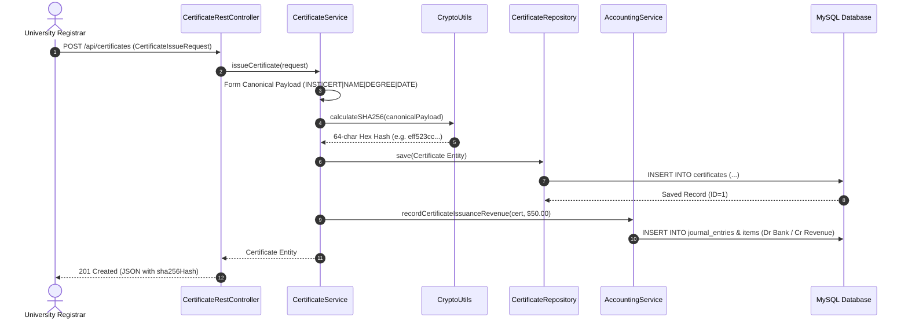
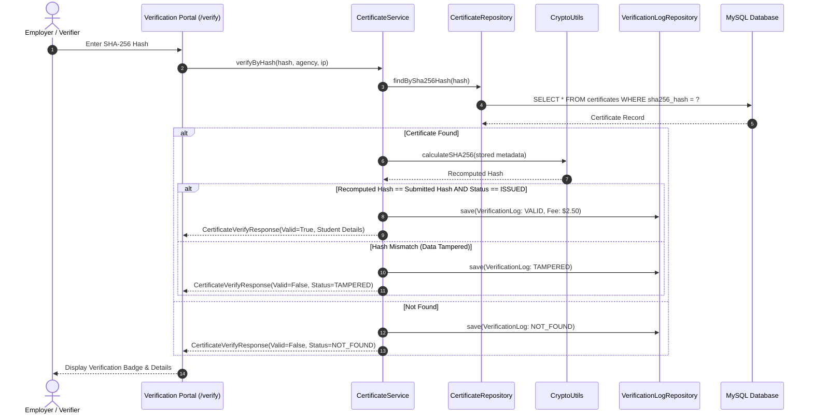
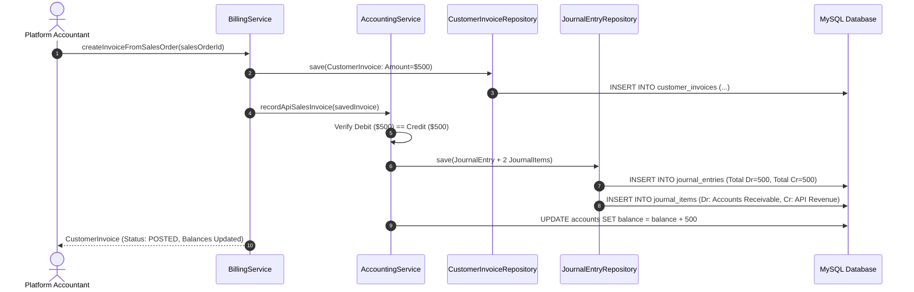

# BLOCKCHAIN-BACKED CERTIFICATE ISSUANCE & VERIFICATION PLATFORM WITH INTEGRATED DOUBLE-ENTRY ACCOUNTING (CERTICHAIN)

**JAVA PROJECT REPORT**  
Submitted in partial fulfillment of the requirements for the award of the degree of  
**BACHELOR OF TECHNOLOGY**  
in  
**ARTIFICIAL INTELLIGENCE AND DATA SCIENCE**  
of  
**ANNA UNIVERSITY**

---

### PROJECT WORK
**Submitted by:**  
**PAVITHRAN P N — 722825243141**  

**BATCH:** 2025 – 2029  

**Under the Guidance of:**  
**Dr. G. SHOBANA, M.E., Ph.D.**  
Associate Professor  

**Department of Artificial Intelligence & Data Science**  
**Sri Eshwar College of Engineering**  
*(An Autonomous Institution – Affiliated to Anna University)*  
**COIMBATORE – 641 202**  

**NOVEMBER 2026**

---

## Sri Eshwar College of Engineering
*(An Autonomous Institution – Affiliated to Anna University)*  
**COIMBATORE – 641 202**

### BONAFIDE CERTIFICATE

Certified that this Report titled **"BLOCKCHAIN-BACKED CERTIFICATE ISSUANCE & VERIFICATION PLATFORM WITH INTEGRATED DOUBLE-ENTRY ACCOUNTING (CERTICHAIN)"** is the bonafide work of:

| Student Name | Register Number |
| :--- | :--- |
| **PAVITHRAN P N** | **722825243141** |

who carried out the project work under my supervision.

<br><br>

----------------------------------------- &emsp;&emsp;&emsp;&emsp;&emsp;&emsp;&emsp;&emsp; -----------------------------------------  
**SIGNATURE** &emsp;&emsp;&emsp;&emsp;&emsp;&emsp;&emsp;&emsp;&emsp;&emsp;&emsp;&emsp;&emsp;&emsp;&emsp;&emsp;&emsp;&emsp;&emsp;&emsp;&emsp;&emsp; **SIGNATURE**  

**Dr. G. Sathish Kumar, M.E., Ph.D.** &emsp;&emsp;&emsp;&emsp;&emsp;&emsp;&emsp;&emsp;&emsp;&emsp;&emsp; **Dr. G. Shobana, M.E., Ph.D.**  
**HEAD OF THE DEPARTMENT** &emsp;&emsp;&emsp;&emsp;&emsp;&emsp;&emsp;&emsp;&emsp;&emsp;&emsp;&emsp;&emsp; **SUPERVISOR**  
Department of Artificial Intelligence and Data Science, &emsp;&emsp;&emsp; Department of Artificial Intelligence and Data Science,  
Sri Eshwar College of Engineering, &emsp;&emsp;&emsp;&emsp;&emsp;&emsp;&emsp;&emsp;&emsp;&emsp; Sri Eshwar College of Engineering,  
Coimbatore – 641 202. &emsp;&emsp;&emsp;&emsp;&emsp;&emsp;&emsp;&emsp;&emsp;&emsp;&emsp;&emsp;&emsp;&emsp;&emsp;&emsp; Coimbatore – 641 202.  

<br>

Submitted for the Autonomous Semester End Mini Project Viva-Voce held on: .........................

<br><br>

_________________________ &emsp;&emsp;&emsp;&emsp;&emsp;&emsp;&emsp;&emsp;&emsp;&emsp;&emsp;&emsp; _________________________  
**INTERNAL EXAMINER** &emsp;&emsp;&emsp;&emsp;&emsp;&emsp;&emsp;&emsp;&emsp;&emsp;&emsp;&emsp;&emsp;&emsp;&emsp;&emsp; **EXTERNAL EXAMINER**

---

## DECLARATION

I, **PAVITHRAN P N (Reg. No: 722825243141)**, hereby declare that the project entitled **"BLOCKCHAIN-BACKED CERTIFICATE ISSUANCE & VERIFICATION PLATFORM WITH INTEGRATED DOUBLE-ENTRY ACCOUNTING (CERTICHAIN)"** submitted in partial fulfillment to Anna University as the project work of Bachelor of Technology in Artificial Intelligence and Data Science Degree, is a record of original work done by me under the supervision and guidance of **Dr. G. Shobana, M.E., Ph.D., Associate Professor**, Department of Artificial Intelligence and Data Science, Sri Eshwar College of Engineering, Coimbatore.

<br>

**Place:** Coimbatore  
**Date:** 28.09.2026  

**PAVITHRAN P N**  
(722825243141)

<br>

**Project Guided by:**  
**Dr. G. Shobana, M.E., Ph.D.**  
Associate Professor / AI & DS

---

## ACKNOWLEDGEMENT

The success of any technical endeavor relies upon collective encouragement, guidance, and cooperation. I take this opportunity to express my profound gratitude and sincere thanks to everyone who helped me bring this project to fruition.

It is indeed my great honor and bounded duty to thank our beloved Chairman, **Mr. R. Mohanram**, for his visionary academic leadership and unwavering support towards student innovation.

I am deeply indebted to our Director, **Mr. R. Rajaram**, for motivating us and providing the modern laboratory infrastructure essential for developing enterprise software.

I wish to express my sincere regards and deep sense of gratitude to **Dr. Sudha Mohanram, M.E., Ph.D., Principal**, for providing exceptional facilities and encouraging multidisciplinary research throughout our course of study.

I express my deep gratitude to **Dr. G. Sathish Kumar, M.E., Ph.D., Head of the Department of Artificial Intelligence and Data Science**, for granting permission to carry out this project and providing complete academic freedom to utilize the high-performance computing resources of the department.

I express my heartfelt thanks to my project Supervisor, **Dr. G. Shobana, M.E., Ph.D., Associate Professor**, Department of Artificial Intelligence and Data Science, for her expert guidance, constructive critiques, technical mentorship, and constant encouragement at every stage of development.

I also extend my sincere thanks to all faculty members, teaching and non-teaching staff of the Artificial Intelligence and Data Science Department, and my family and friends for their continuous support and inspiration.

---

## TABLE OF CONTENTS

| Section | Title | Page No. |
| :---: | :--- | :---: |
| | **ABSTRACT** | **1** |
| **1** | **INTRODUCTION** | **2** |
| | 1.1 Background of the Project | 2 |
| | 1.2 Problem Statement | 3 |
| | 1.3 Existing System & Its Limitations | 4 |
| | 1.4 Proposed Solution | 5 |
| | 1.5 Objectives of the Project | 6 |
| | 1.6 Scope of the Project | 7 |
| **2** | **SYSTEM ANALYSIS & ARCHITECTURE** | **8** |
| | 2.1 System Overview & Architecture | 8 |
| | 2.2 Core Modules & Functionalities | 9 |
| | 2.3 Input → Processing → Output Pipeline | 11 |
| | 2.4 Inter-Module Communication Flow | 12 |
| **3** | **UML & SYSTEM DESIGN DIAGRAMS** | **13** |
| | 3.1 Use Case Diagram & Actor Narratives | 13 |
| | 3.2 Class Diagram & Entity Relationships | 15 |
| | 3.3 Sequence Diagram: Certificate Issuance Flow | 17 |
| | 3.4 Sequence Diagram: Cryptographic Verification Flow | 18 |
| | 3.5 Sequence Diagram: Double-Entry Financial Invoicing Flow | 19 |
| | 3.6 Overall System Flowchart | 20 |
| **4** | **DATABASE DESIGN & SPECIFICATION** | **21** |
| | 4.1 Schema Architecture & Relational Model | 21 |
| | 4.2 Entity-Relationship (ER) Diagram | 22 |
| | 4.3 Database Tables & Data Dictionary | 23 |
| | 4.4 Integrity Constraints & Business Rule Enforcement | 28 |
| **5** | **PROJECT WORKFLOW & EXECUTION LIFECYCLE** | **29** |
| | 5.1 End-to-End Operational Lifecycle | 29 |
| | 5.2 Layered Request-Response Flow | 31 |
| **6** | **IMPLEMENTATION & CODE WALKTHROUGH** | **32** |
| | 6.1 Cryptographic SHA-256 Engine | 32 |
| | 6.2 JPA Entity Mapping (`Certificate.java`) | 33 |
| | 6.3 Certificate Issuance & Verification Logic (`CertificateService.java`) | 34 |
| | 6.4 Double-Entry Balanced Ledger Engine (`AccountingService.java`) | 36 |
| | 6.5 Enterprise REST API Surface (`CertificateRestController.java`) | 38 |
| **7** | **RESULTS & OUTPUT ANALYSIS** | **40** |
| | 7.1 Figure 1: Executive Analytics Dashboard & KPI Metrics | 40 |
| | 7.2 Figure 2: Public Cryptographic Verification Portal (Authentic Match) | 41 |
| | 7.3 Figure 3: Tamper Detection & Revocation Lookup | 42 |
| | 7.4 Figure 4: Academic Credential Issuance Interface | 43 |
| | 7.5 Figure 5: Commercial Invoicing & Vendor Billing Center | 44 |
| | 7.6 Figure 6: Real-Time Balanced General Ledger Records | 45 |
| | 7.7 Figure 7: Automated Balance Sheet & Profit and Loss Statements | 46 |
| | 7.8 Figure 8: Operational Unit Budget vs. Actual Monitoring | 47 |
| **8** | **CONCLUSION & FUTURE SCOPE** | **48** |
| | 8.1 Conclusion | 48 |
| | 8.2 Future Scope | 49 |
| **9** | **REFERENCES** | **50** |
| **10** | **PROJECT METADATA, SDG & TRL MAPPING** | **51** |
| **11** | **VENUE & EXPENDITURE STATEMENT** | **52** |

---

# ABSTRACT

Academic credential fraud, fake diplomas, and document tampering represent a severe global challenge that undermines institutional trust and compromises employer hiring processes. Traditional certificate management approaches rely either on vulnerable physical paper documents or centralized database repositories that are susceptible to unauthorized modifications, data breaches, and slow, manual verification workflows. Furthermore, institutional educational platforms operate in total isolation from the commercial and financial transactions generated by credential management, such as student issuance fees, third-party verification query charges, and cloud hosting expenditures. This disconnect leads to severe operational inefficiencies, unreconciled accounts, and lack of budget transparency.

To resolve these challenges, this project presents **CertiChain**: a full-stack, enterprise-grade Java application powered by Spring Boot 3.x, Spring Data JPA, and a normalized MySQL 8.x relational database management system. CertiChain combines **SHA-256 cryptographic fingerprinting** with immutable ledger principles to guarantee tamper-proof credential issuance and instant public verification without relying on centralized manual checks. When an accredited institution registers a graduate, the system computes a deterministic 64-character SHA-256 hash derived from the institutional code, serial number, student identity, degree, and issue date. This cryptographic fingerprint acts as an immutable digital seal stored in indexed relational tables. Third-party verifiers, including employers and background-check agencies, can instantly recompute and validate the credential's mathematical integrity in real time ($O(1)$ lookup time), immediately identifying unauthorized modifications, fraudulent certificates, or revoked records.

In addition to academic verification, CertiChain integrates a complete **automated double-entry general ledger accounting core** and commercial ERP subsystem. Every operational event—such as issuing a certificate, invoicing an agency for bulk verification API queries, receiving bank payments, or settling cloud infrastructure bills—automatically generates mathematically balanced journal entries ($\sum \text{Debit} = \sum \text{Credit}$). Financial statements, including real-time Balance Sheets, Profit and Loss (P&L) accounts, and Operational Unit Budget performance reports, are dynamically generated directly from general ledger lines. The application features a modern, responsive web interface built with Thymeleaf, Vanilla CSS, and modern typography, complemented by secure REST API endpoints for seamless third-party integration. The result is a secure, verifiable, auditable, and financially self-contained platform that demonstrates how relational database architecture, cryptographic integrity, and enterprise accounting logic can be unified into an efficient software solution.

---

# 1. INTRODUCTION

## 1.1 Background of the Project
Higher education institutions, universities, and professional accreditation bodies issue millions of academic degrees, diplomas, and transcripts annually. These credentials serve as the primary currency for employment, professional licensing, and postgraduate admissions. In the modern digital economy, the speed and accuracy with which credentials can be authenticated directly dictate the efficiency of corporate recruitment and academic admissions.

Historically, certificate verification has been an offline, labor-intensive process. Background verification agencies and prospective employers contact university registrars via postal mail, phone, or email to verify student records against archived institutional ledgers. As digital transformation progressed, institutions began generating digital PDF certificates and providing basic web lookup portals. However, traditional database-backed solutions remain architecturally centralized. If a centralized database is compromised or modified by an internal actor, unauthorized alterations cannot be detected mathematically.

Moreover, academic institutions and background-check platforms incur significant operational overheads. Maintaining high-availability database servers, cryptographic Hardware Security Modules (HSMs), and administrative staff requires financial capital. Simultaneously, verification services generate operational revenues by billing enterprise recruitment agencies for API lookup packages. In standard institutional environments, the educational issuance software is completely detached from the organizational accounting software (such as SAP, Tally, or Excel spreadsheets). This architectural separation causes reconciliation delays, invoice discrepancies, and an inability to track unit-level profitability.

## 1.2 Problem Statement
Traditional academic credential management and background verification systems suffer from critical architectural and operational vulnerabilities:
1. **Pervasive Credential Forgery:** Digital certificates stored as plain PDFs or centralized records can be easily duplicated, photoshopped, or altered, with no automated mathematical proof of authenticity.
2. **Vulnerability of Centralized Repositories:** Standard relational databases without cryptographic integrity guarantees remain vulnerable to unauthorized SQL updates, administrative tampering, or malicious insider actions.
3. **Slow, Inefficient Verification Workflows:** Third-party verifiers (employers, foreign embassies, recruitment agencies) must wait days or weeks for manual institutional responses.
4. **Disconnected Financial and Operational Systems:** Commercial events (such as bulk verification API sales or server hosting expenses) are maintained in disconnected accounting spreadsheets, resulting in unreconciled ledgers, uncollected debts, and lack of real-time auditability.
5. **Absence of Real-Time Budget Oversight:** Institutional departments cannot evaluate planned operational budgets against actual verification revenues and cloud infrastructure expenditures in real time.

## 1.3 Existing System & Its Limitations

### The Existing Scenario
In current university setups, certificates are issued as paper documents with physical watermarks or exported as standard PDF files. Verification is handled through ad-hoc web forms or bilateral email communication between background verification firms and university examination cells. Financial processes (fee receipts and vendor hosting payments) are logged independently in separate accounting packages with zero automated synchronization.

```
+-------------------------------------------------------------------------------+
|                             EXISTING DISCONNECTED SYSTEM                      |
+-------------------------------------------------------------------------------+
|  [University Registrar] ---> (Centralized DB / Manual PDFs) ---> [Student]    |
|                                         |                                     |
|                                         v (No Cryptographic Fingerprint)      |
|  [Employer / Agency]    ---> (Manual Email / Postal Checks) ---> [Delayed Auth] |
|                                                                               |
|  [Financial Billing]    ---> (Disconnected Excel Spreadsheets) ---> [Errors]  |
+-------------------------------------------------------------------------------+
```

### Critical Limitations of the Existing System:
* **Lack of Data Immutability:** No cryptographic hash or checksum exists to prove that a certificate has remained unaltered since its initial issuance.
* **Single Point of Failure & Trust:** Third parties must unconditionally trust the central server administrator, creating vulnerability to internal corruption.
* **Manual Verification Bottlenecks:** Verification agencies experience extensive delays, slowing down student hiring pipelines.
* **High Operational Overhead:** Administrative staff spend thousands of hours answering routine verification queries.
* **Accounting Discrepancies:** Manual journal posting between billing logs and bank statements results in frequent human bookkeeping errors and violated double-entry constraints.

## 1.4 Proposed Solution
The proposed system, **CertiChain**, introduces a unified enterprise architecture built on Java, Spring Boot 3.x, Spring Data JPA, and MySQL 8.x. It fuses **cryptographic SHA-256 fingerprinting** with an **automated double-entry general ledger engine** to deliver end-to-end credential integrity and transparent financial governance.

```
+-------------------------------------------------------------------------------+
|                            PROPOSED CERTICHAIN SYSTEM                         |
+-------------------------------------------------------------------------------+
|  [University Registrar]                                                       |
|           │                                                                   |
|           ▼                                                                   |
|  [SHA-256 Cryptographic Engine] ───> Generates 64-char Fingerprint            |
|           │                                                                   |
|           ▼                                                                   |
|  [MySQL 8.x Normalized DBMS]    ───> Stores Credential & Indexed Hash         |
|           │                                                                   |
|           ├───────────────────────────────────────────────────────┐           |
|           ▼                                                       ▼           |
|  [Public Verification Portal]                           [Automated Accounting]|
|  - Instant O(1) Lookup                                  - Double-Entry Engine |
|  - Real-Time Hash Recomputation                         - Sales & Purchase PO |
|  - Status: VALID / REVOKED / TAMPERED                   - Balance Sheet & P&L |
+-------------------------------------------------------------------------------+
```

### Key Technical Innovations in CertiChain:
1. **Deterministic SHA-256 Cryptographic Fingerprint:** Every issued certificate receives an unforgeable 64-character hash computed from its institutional code, serial number, student name, degree, and issue date.
2. **Instant Public Hash Verification Engine:** Verifiers enter a hash or query the REST API (`/api/certificates/verify/{hash}`). The system dynamically reconstructs the expected payload, recomputes the SHA-256 digest, and compares it against the stored record, instantly detecting if even a single character was altered.
3. **Automated Double-Entry General Ledger Core:** Every transaction automatically logs balanced Debit and Credit journal lines ($\sum \text{Dr} = \sum \text{Cr}$). Issuance fees ($50.00), API verification packages ($250.00), and cloud hosting bills ($1,200.00) update ledger balances without manual intervention.
4. **Real-Time Financial Reporting & Budgeting:** Balance sheets, Profit & Loss accounts, and Operational Unit Budget variance statements are dynamically generated from posted journal items.
5. **Modern, Responsive Web Interface:** A lightweight web UI (built with Thymeleaf, Bricolage Grotesque display typography, Inter body sans, and vivid accents) provides registrars, accountants, and verifiers with intuitive, accessible workflows.

## 1.5 Objectives of the Project
The primary engineering objectives of CertiChain are:
1. To design and implement a high-performance relational database schema in MySQL 8.x mapped seamlessly through Spring Data JPA entities and repositories.
2. To develop a cryptographic utility utilizing Java's `java.security.MessageDigest` to compute deterministic SHA-256 hashes for all issued credentials.
3. To build a high-speed verification engine capable of $O(1)$ lookups that verifies certificate status (`VALID`, `REVOKED`, `TAMPERED_OR_NOT_FOUND`) and records an immutable verification audit log.
4. To implement a strictly balanced double-entry accounting subsystem that automatically records sales orders, customer invoices, purchase orders, vendor bills, and bank payment settlements.
5. To enforce the fundamental accounting invariant ($\sum \text{Debit} = \sum \text{Credit}$) across all financial transactions, preventing unbalanced postings at both the database and application levels.
6. To engineer dynamic reporting services that generate live Profit and Loss statements, Balance Sheets, and Operational Unit Budget performance analyses.
7. To expose secure, well-documented REST API endpoints (`/api/certificates`, `/api/institutions`, `/api/accounting`, `/api/reports`) for seamless integration with external third-party software.

## 1.6 Scope of the Project
The project encompasses:
* **Academic Registrars:** Accreditation and onboarding of higher education institutions, creation of degree programs, and cryptographic issuance of credentials.
* **Public Verifiers & Agencies:** Self-service hash verification lookup portal, QR code compatibility, and background agency API integration.
* **Financial Accountants:** Management of service product catalogs, automated billing of background check agencies, cloud vendor payables processing, and real-time ledger auditing.
* **Administrative Leadership:** High-level dashboard visualization of platform statistics, verification query traffic, institutional growth, net profit, and departmental budget variance.

---

# 2. SYSTEM ANALYSIS & ARCHITECTURE

## 2.1 System Overview & Architecture
CertiChain is architected as an enterprise-grade, layered monolithic Spring Boot application. It adheres strictly to the **Separation of Concerns (SoC)** principle across five primary structural layers:

```
+-------------------------------------------------------------------------------+
|                       CERTICHAIN LAYERED ARCHITECTURE                         |
+-------------------------------------------------------------------------------+
|  1. PRESENTATION LAYER (Web UI & REST Controllers)                            |
|     - WebViewController (Thymeleaf HTML5, CSS3, Inter / Bricolage Fonts)      |
|     - CertificateRestController, AccountingRestController, ReportController  |
+-------------------------------------------------------------------------------+
                                      │
                                      ▼
+-------------------------------------------------------------------------------+
|  2. DTO & VALIDATION LAYER                                                    |
|     - CertificateIssueRequest, CertificateVerifyResponse, FinancialReportDto  |
|     - Jakarta Bean Validation (@NotBlank, @NotNull, @Size)                    |
+-------------------------------------------------------------------------------+
                                      │
                                      ▼
+-------------------------------------------------------------------------------+
|  3. BUSINESS SERVICE LAYER                                                    |
|     - CertificateService (Issuance & Verification logic)                      |
|     - CryptoUtils (SHA-256 cryptographic hashing engine)                      |
|     - AccountingService (Double-entry debit/credit ledger posting)            |
|     - BillingService (SalesOrder -> Invoice -> Payment lifecycle)             |
|     - ReportService (Live Balance Sheet, P&L, and Budget aggregation)         |
+-------------------------------------------------------------------------------+
                                      │
                                      ▼
+-------------------------------------------------------------------------------+
|  4. DATA ACCESS LAYER (Spring Data JPA Repositories)                          |
|     - CertificateRepository, AccountRepository, JournalEntryRepository, etc.  |
|     - Hibernate ORM Dialect & Custom JPQL Aggregate Queries                   |
+-------------------------------------------------------------------------------+
                                      │
                                      ▼
+-------------------------------------------------------------------------------+
|  5. PERSISTENCE LAYER (Relational DBMS)                                       |
|     - MySQL 8.x Server (InnoDB Engine, ACID Transactions, B-Tree Indexes)     |
+-------------------------------------------------------------------------------+
```

## 2.2 Core Modules & Functionalities

### Module 1: Academic & Institution Management
* **Institution Onboarding:** Manages accredited universities and colleges with unique institutional codes (e.g., `SECE-7228`, `AU-0001`), official contact emails, and accreditation statuses.
* **Credential Master:** Registers degree titles (e.g., *Bachelor of Technology*), academic majors (e.g., *Artificial Intelligence and Data Science*), student roll numbers, and CGPA metrics.

### Module 2: Cryptographic Hashing & Verification Engine
* **SHA-256 Digest Computation:** Concatenates normalized certificate metadata (`INST:<code>|CERT:<num>|NAME:<name>|DEGREE:<deg>|DATE:<date>`) and passes it through `MessageDigest.getInstance("SHA-256")` to generate a 256-bit (64 hex characters) digital fingerprint.
* **Integrity Audit & Lookup:** Queries the indexed `sha256_hash` column. Upon retrieval, the engine re-runs the hashing algorithm on stored fields. If the database record was illegally modified, the recomputed hash fails to match, flagging the credential as `TAMPERED`.
* **Verification Audit Logging:** Logs every query timestamp, requesting agency, IP address, and validity result for legal auditing and billing.

### Module 3: Commercial ERP & Billing Subsystem
* **Contact Directory:** Classifies enterprise entities into `UNIVERSITY_CLIENT`, `AGENCY_CUSTOMER` (e.g., Global Background Verification Agency), and `CLOUD_VENDOR` (e.g., AWS/Azure Hosting).
* **Product Catalog:** Maintains service items with standardized unit pricing (e.g., *Certificate Cryptographic Issuance* @ $50.00, *API Query Package* @ $250.00, *Cloud HSM Hosting* @ $1,200.00).
* **Order-to-Cash & Procure-to-Pay Lifecycles:**
  * Sales Order $\rightarrow$ Customer Invoice $\rightarrow$ Bank Payment Receipt.
  * Purchase Order $\rightarrow$ Vendor Bill $\rightarrow$ Bank Payment Disbursement.

### Module 4: Double-Entry General Ledger Core
* **Chart of Accounts:** Hierarchical classification into `ASSET` (1000s), `LIABILITY` (2000s), `EQUITY` (3000s), `INCOME` (4000s), and `EXPENSE` (5000s).
* **Automated Balancing Engine:** Rejects any transaction where total debits do not equal total credits:
$$\sum \text{Debit} - \sum \text{Credit} = 0$$
* **Zero-Touch Posting:** Issuing a certificate or paying a bill automatically triggers the corresponding ledger lines behind the scenes.

### Module 5: Financial Analytics & Budgeting
* **Profit & Loss Statement:** Dynamically computes total operational revenues minus operating expenses to derive Net Platform Profit.
* **Balance Sheet:** Aggregates technology assets and cash balances against vendor payables to calculate Platform Equity.
* **Budget Tracking:** Monitors actual income and expenditures against allocated departmental budget caps (`AN-OPS-01: Enterprise Verification API Sector`).

## 2.3 Input → Processing → Output Pipeline

| Operational Step | Input Data | Processing & Business Logic | Generated Output |
| :--- | :--- | :--- | :--- |
| **1. Certificate Issuance** | Student Name, Roll No, Degree, Major, CGPA, Issue Date, Institution ID. | 1. Validate mandatory fields.<br>2. Format canonical string.<br>3. Compute SHA-256 hash.<br>4. Persist entity in MySQL.<br>5. Generate $50.00 issuance ledger entry. | Saved Certificate with unique 64-character SHA-256 hash, updated Sales Ledger. |
| **2. Hash Verification** | 64-character SHA-256 Hash string, Verifier Agency, IP address. | 1. Query `certificates` table by hash.<br>2. Recompute hash from stored fields.<br>3. Check certificate status (`ISSUED` vs `REVOKED`).<br>4. Log verification attempt & record $2.50 query fee. | `CertificateVerifyResponse` JSON / UI Badge (`VALID`, `REVOKED`, `TAMPERED`). |
| **3. Agency Invoicing** | Agency Customer ID, Product ID (`API Package`), Quantity. | 1. Compute total amount ($Q \times \text{Price}$).<br>2. Generate `SalesOrder` & `CustomerInvoice`.<br>3. Post Debit: Accounts Receivable (1020), Credit: API Revenue (4020). | Posted `CustomerInvoice`, balanced Journal Entry (`JE-SALES`). |
| **4. Bank Payment Settlement** | Invoice ID / Vendor Bill ID, Bank Journal ID. | 1. Mark Invoice as `PAID`.<br>2. Create `Payment` entity.<br>3. Post Debit: Bank (1010), Credit: Accounts Receivable (1020). | Updated Bank Balance, settled invoice, `PAY-REC` record. |
| **5. Financial Reporting** | Date Range / Request Trigger. | 1. Aggregate balances from `accounts` & `journal_items`.<br>2. Calculate $\text{Revenue} - \text{Expenses}$.<br>3. Calculate $\text{Assets} - \text{Liabilities}$.<br>4. Compute budget variances. | Live Profit & Loss statement, Balance Sheet, and Unit Budget Performance report. |

---

# 3. UML & SYSTEM DESIGN DIAGRAMS

## 3.1 Use Case Diagram & Actor Narratives



### Actor Narratives:
1. **University Registrar (Admin):** Authenticates into the institutional portal, registers accredited academic departments, and submits student graduation records to generate cryptographic certificates.
2. **Verifier (Employer / Background Check Firm):** Accesses the public verification portal or submits automated REST API queries with certificate hashes to verify applicant credentials instantly.
3. **Platform Accountant:** Manages service rates, generates commercial invoices for verification firms, processes vendor hosting bills, and monitors the general ledger.
4. **Cloud Infrastructure Vendor:** Supplies dedicated cryptographic servers and issues monthly infrastructure bills.
5. **CertiChain Core Engine (System):** Automatically executes SHA-256 hashing, validates mathematical checksums, logs audit trails, and balances journal entries ($\text{Dr} = \text{Cr}$).

---

## 3.2 Class Diagram & Entity Relationships



---

## 3.3 Sequence Diagram: Certificate Issuance Flow



---

## 3.4 Sequence Diagram: Cryptographic Verification Flow



---

## 3.5 Sequence Diagram: Double-Entry Financial Invoicing Flow



---

# 4. DATABASE DESIGN & SPECIFICATION

## 4.1 Schema Architecture & Relational Model
The database layer is implemented on **MySQL 8.x** utilizing the **InnoDB** storage engine, ensuring full **ACID (Atomicity, Consistency, Isolation, Durability)** compliance. Data access is governed by Spring Data JPA with Hibernate ORM.

The schema is partitioned into four functional domains:
1. **Academic Credential Domain:** `institutions`, `certificates`, `verification_logs`.
2. **Commercial Entity & Catalog Domain:** `contacts`, `products`.
3. **Transaction Processing Domain:** `sales_orders`, `customer_invoices`, `purchase_orders`, `vendor_bills`, `payments`.
4. **General Ledger & Financial Accounting Domain:** `accounts`, `journals`, `journal_entries`, `journal_items`, `analytic_accounts`, `budgets`.

```
+----------------------------------------------------------------------------------------------------+
|                                    RELATIONAL SCHEMA ARCHITECTURE                                  |
+----------------------------------------------------------------------------------------------------+
|  [institutions] ──(1:N)──> [certificates] <──(Lookup)── [verification_logs]                        |
|                                                                                                    |
|  [contacts]     ──(1:N)──> [sales_orders]   ──(1:1)──> [customer_invoices] <──┐                     |
|  [contacts]     ──(1:N)──> [purchase_orders]──(1:1)──> [vendor_bills]      <──┤                     |
|                                                                             │                      |
|                                                                    (Source Document)               |
|                                                                             │                      |
|  [journals]     ──(1:N)──> [journal_entries] ──(1:N)──> [journal_items] ────┘                      |
|                                                                 │                                  |
|  [accounts]     ────────────────────────────────────────────────┘ (Mapped via account_id)          |
|  [analytic_acc] ────────────────(1:N)──> [budgets]                                                 |
+----------------------------------------------------------------------------------------------------+
```

---

## 4.2 Database Tables & Data Dictionary

### Table 1: `institutions`
Stores accredited universities, colleges, and examination bodies authorized to issue credentials.

| Column Name | Data Type | Constraints | Description |
| :--- | :--- | :--- | :--- |
| `id` | `BIGINT` | `PRIMARY KEY`, `AUTO_INCREMENT` | Unique institution surrogate identifier |
| `name` | `VARCHAR(255)` | `NOT NULL`, `UNIQUE` | Official name of the university/college |
| `code` | `VARCHAR(20)` | `NOT NULL`, `UNIQUE` | Institutional prefix code (e.g. `SECE-7228`) |
| `email` | `VARCHAR(255)` | `NULL` | Registrar office official email address |
| `website` | `VARCHAR(255)` | `NULL` | Official institutional web URL |
| `accredited` | `BOOLEAN` | `NOT NULL`, `DEFAULT TRUE` | Accreditation and authorization flag |
| `created_at` | `DATETIME(6)` | `NOT NULL` | Timestamp of institutional registration |

### Table 2: `certificates`
Stores tamper-proof issued credentials containing the unique SHA-256 hash.

| Column Name | Data Type | Constraints | Description |
| :--- | :--- | :--- | :--- |
| `id` | `BIGINT` | `PRIMARY KEY`, `AUTO_INCREMENT` | Unique certificate surrogate identifier |
| `certificate_number`| `VARCHAR(100)` | `NOT NULL`, `UNIQUE` | Institutional serial / roll number |
| `student_name` | `VARCHAR(255)` | `NOT NULL` | Full legal name of the student |
| `student_email` | `VARCHAR(255)` | `NULL` | Student contact email |
| `degree` | `VARCHAR(255)` | `NOT NULL` | Degree program (e.g. *B.Tech*) |
| `major` | `VARCHAR(255)` | `NULL` | Major specialization (e.g. *AI & DS*) |
| `cgpa` | `DOUBLE` | `NULL` | Cumulative Grade Point Average |
| `issue_date` | `DATE` | `NOT NULL` | Formal credential conferral date |
| `institution_id` | `BIGINT` | `NOT NULL`, `FK(institutions.id)` | Issuing academic institution |
| `sha256_hash` | `VARCHAR(64)` | `NOT NULL`, `UNIQUE`, `INDEX` | Cryptographic SHA-256 fingerprint |
| `status` | `VARCHAR(20)` | `NOT NULL`, `DEFAULT 'ISSUED'` | Credential status (`ISSUED`, `REVOKED`) |
| `revocation_reason` | `VARCHAR(500)` | `NULL` | Explanation if credential was revoked |
| `created_at` | `DATETIME(6)` | `NOT NULL` | On-chain ledger timestamp |

### Table 3: `verification_logs`
Maintains an immutable query log of all public and API verification requests.

| Column Name | Data Type | Constraints | Description |
| :--- | :--- | :--- | :--- |
| `id` | `BIGINT` | `PRIMARY KEY`, `AUTO_INCREMENT` | Unique audit log ID |
| `certificate_hash` | `VARCHAR(64)` | `NOT NULL` | The SHA-256 hash queried |
| `verifier_agency` | `VARCHAR(255)` | `NULL` | Name of the inquiring company/agency |
| `verifier_ip` | `VARCHAR(50)` | `NULL` | Client IP address of the requester |
| `is_valid` | `BOOLEAN` | `NOT NULL` | Authenticity outcome (`TRUE`/`FALSE`) |
| `fee_charged` | `DECIMAL(10,2)` | `NOT NULL`, `DEFAULT 0.00` | Revenue logged for query execution |
| `verification_time`| `DATETIME(6)` | `NOT NULL` | Timestamp of lookup event |

### Table 4: `contacts`
Master entity directory for clients, agencies, and vendors.

| Column Name | Data Type | Constraints | Description |
| :--- | :--- | :--- | :--- |
| `id` | `BIGINT` | `PRIMARY KEY`, `AUTO_INCREMENT` | Contact master surrogate ID |
| `name` | `VARCHAR(255)` | `NOT NULL` | Entity name (University / Agency / Vendor) |
| `type` | `VARCHAR(30)` | `NOT NULL` | `UNIVERSITY_CLIENT`, `AGENCY_CUSTOMER`, `CLOUD_VENDOR` |
| `email` | `VARCHAR(255)` | `NULL` | Primary billing / contact email |
| `phone` | `VARCHAR(50)` | `NULL` | Contact telephone number |
| `address` | `VARCHAR(500)` | `NULL` | Physical business address |
| `created_at` | `DATETIME(6)` | `NOT NULL` | Record creation timestamp |

### Table 5: `products`
Service catalog defining operational deliverables and pricing.

| Column Name | Data Type | Constraints | Description |
| :--- | :--- | :--- | :--- |
| `id` | `BIGINT` | `PRIMARY KEY`, `AUTO_INCREMENT` | Product surrogate ID |
| `code` | `VARCHAR(30)` | `NOT NULL`, `UNIQUE` | Item code (e.g. `PROD-CERT-ISSUE`) |
| `name` | `VARCHAR(255)` | `NOT NULL` | Service name |
| `type` | `VARCHAR(20)` | `NOT NULL` | `SERVICE`, `PHYSICAL` |
| `unit_price` | `DECIMAL(12,2)` | `NOT NULL` | Unit rate in USD |
| `description` | `VARCHAR(500)` | `NULL` | Detailed technical deliverable scope |

### Table 6: `accounts` (Chart of Accounts)
Master general ledger accounts for double-entry bookkeeping.

| Column Name | Data Type | Constraints | Description |
| :--- | :--- | :--- | :--- |
| `id` | `BIGINT` | `PRIMARY KEY`, `AUTO_INCREMENT` | Account master ID |
| `code` | `VARCHAR(20)` | `NOT NULL`, `UNIQUE` | General Ledger Code (`1010`, `1020`, `4010`, etc.) |
| `name` | `VARCHAR(255)` | `NOT NULL` | Account title (e.g. *Bank Assets*, *API Revenue*) |
| `type` | `VARCHAR(20)` | `NOT NULL` | `ASSET`, `LIABILITY`, `EQUITY`, `INCOME`, `EXPENSE` |
| `balance` | `DECIMAL(14,2)` | `NOT NULL`, `DEFAULT 0.00` | Current real-time account balance |

### Table 7: `journals`
Transaction journals categorizing operational postings.

| Column Name | Data Type | Constraints | Description |
| :--- | :--- | :--- | :--- |
| `id` | `BIGINT` | `PRIMARY KEY`, `AUTO_INCREMENT` | Journal surrogate ID |
| `code` | `VARCHAR(20)` | `NOT NULL`, `UNIQUE` | Journal identifier (`SALES`, `PURCHASE`, `BANK`) |
| `name` | `VARCHAR(255)` | `NOT NULL` | Journal title |
| `type` | `VARCHAR(20)` | `NOT NULL` | Category (`SALES`, `PURCHASE`, `BANK`, `CASH`) |

### Table 8: `journal_entries` & `journal_items`
Header and line-item tables enforcing balanced double-entry accounting.

**`journal_entries` (Header)**
| Column Name | Data Type | Constraints | Description |
| :--- | :--- | :--- | :--- |
| `id` | `BIGINT` | `PRIMARY KEY`, `AUTO_INCREMENT` | Transaction header ID |
| `entry_number` | `VARCHAR(30)` | `NOT NULL`, `UNIQUE` | Formatted audit number (`JE-2026-XXXX`) |
| `entry_date` | `DATE` | `NOT NULL` | Accounting posting date |
| `reference` | `VARCHAR(255)` | `NULL` | Source reference (`INV-001`, `CERT-001`) |
| `journal_id` | `BIGINT` | `NOT NULL`, `FK(journals.id)` | Associated journal |
| `status` | `VARCHAR(20)` | `NOT NULL`, `DEFAULT 'POSTED'` | Posting status (`DRAFT`, `POSTED`, `CANCELLED`) |
| `total_debit` | `DECIMAL(14,2)` | `NOT NULL` | Total debit magnitude |
| `total_credit` | `DECIMAL(14,2)` | `NOT NULL` | Total credit magnitude ($\text{Total Dr} = \text{Total Cr}$) |

**`journal_items` (Debit/Credit Lines)**
| Column Name | Data Type | Constraints | Description |
| :--- | :--- | :--- | :--- |
| `id` | `BIGINT` | `PRIMARY KEY`, `AUTO_INCREMENT` | Line item identifier |
| `journal_entry_id` | `BIGINT` | `NOT NULL`, `FK(journal_entries.id)` | Parent transaction header |
| `account_id` | `BIGINT` | `NOT NULL`, `FK(accounts.id)` | Debited or Credited ledger account |
| `label` | `VARCHAR(255)` | `NULL` | Descriptive line narrative |
| `debit` | `DECIMAL(14,2)` | `NOT NULL`, `DEFAULT 0.00` | Debit amount |
| `credit` | `DECIMAL(14,2)` | `NOT NULL`, `DEFAULT 0.00` | Credit amount |
| `analytic_account_id`| `BIGINT`| `NULL`, `FK(analytic_accounts.id)`| Optional departmental cost center link |

### Table 9: `analytic_accounts` & `budgets`
Departmental cost centers and operational budget allocations.

| Table | Column Name | Data Type | Constraints | Description |
| :--- | :--- | :--- | :--- | :--- |
| `analytic_accounts` | `id` | `BIGINT` | `PK`, `AUTO_INC` | Cost center ID |
| | `code` | `VARCHAR(30)` | `NOT NULL`, `UNIQUE` | Code (e.g. `AN-OPS-01`) |
| | `name` | `VARCHAR(255)` | `NOT NULL` | Unit title (*Enterprise Verification Sector*) |
| `budgets` | `id` | `BIGINT` | `PK`, `AUTO_INC` | Budget allocation ID |
| | `name` | `VARCHAR(255)` | `NOT NULL` | Budget fiscal title |
| | `analytic_account_id`| `BIGINT` | `NOT NULL`, `FK` | Linked operational unit |
| | `planned_revenue` | `DECIMAL(14,2)` | `NOT NULL` | Target revenue benchmark |
| | `planned_expense` | `DECIMAL(14,2)` | `NOT NULL` | Expenditure cap |

---

# 5. PROJECT WORKFLOW & EXECUTION LIFECYCLE

## 5.1 End-to-End Operational Lifecycle
The complete workflow of CertiChain comprises five tightly integrated phases:

```
+----------------------------------------------------------------------------------------------------+
|                                COMPLETE OPERATIONAL WORKFLOW                                       |
+----------------------------------------------------------------------------------------------------+
|  Phase 1: Institution Accreditation & Setup                                                        |
|     Admin registers University (Name, Code, Email) ──> Persists in `institutions` table           |
|                                                                                                    |
|  Phase 2: Cryptographic Credential Issuance                                                        |
|     Registrar enters Student Details ──> Canonical Payload Built ──> SHA-256 Digest Computed       |
|     ──> Record Saved in `certificates` (Hash Indexed) ──> Auto-Post Issuance Fee Revenue ($50)     |
|                                                                                                    |
|  Phase 3: Public Hash Verification & Integrity Check                                               |
|     Verifier submits 64-char Hash ──> Instant Index Lookup ──> Recompute Payload Hash from DB      |
|     ──> Match Verified? ──> Yes: Output VALID | No: Output TAMPERED / NOT_FOUND                    |
|     ──> Verification Logged in `verification_logs` ($2.50 API Fee Tracked)                         |
|                                                                                                    |
|  Phase 4: Commercial ERP Invoicing & Bank Settlements                                              |
|     Agency buys API Query Package ──> Sales Order ──> Customer Invoice ──> Bank Payment Settlement|
|     Cloud Vendor billed ──> Purchase Order ──> Vendor Bill ──> Bank Disbursement Settlement        |
|     ──> Automatically writes balanced Journal Entries (Debit = Credit)                             |
|                                                                                                    |
|  Phase 5: Real-Time Financial & Budget Governance                                                  |
|     General Ledger Lines Aggregated ──> Live Balance Sheet + P&L + Unit Budget Variance Computed  |
+----------------------------------------------------------------------------------------------------+
```

---

# 6. IMPLEMENTATION & CODE WALKTHROUGH

## 6.1 Cryptographic SHA-256 Engine (`CryptoUtils.java`)
The cryptographic core relies on Java's built-in `java.security.MessageDigest` to generate irreversible, deterministic 256-bit digests.

```java
package com.example.demo.util;

import java.nio.charset.StandardCharsets;
import java.security.MessageDigest;
import java.security.NoSuchAlgorithmException;

public class CryptoUtils {

    /**
     * Calculates a deterministic SHA-256 cryptographic hash string.
     * Guarantees tamper-proof credential fingerprinting.
     */
    public static String calculateSHA256(String data) {
        if (data == null) {
            throw new IllegalArgumentException("Data to hash cannot be null");
        }
        try {
            MessageDigest digest = MessageDigest.getInstance("SHA-256");
            byte[] hashBytes = digest.digest(data.getBytes(StandardCharsets.UTF_8));

            StringBuilder hexString = new StringBuilder();
            for (byte b : hashBytes) {
                String hex = Integer.toHexString(0xff & b);
                if (hex.length() == 1) {
                    hexString.append('0');
                }
                hexString.append(hex);
            }
            return hexString.toString();
        } catch (NoSuchAlgorithmException e) {
            throw new RuntimeException("SHA-256 algorithm not available in environment", e);
        }
    }
}
```
**Explanation:** The method converts the canonical text string to UTF-8 bytes and computes the SHA-256 digest. It iterates through the resulting 32 bytes, converting each byte into a two-digit hexadecimal representation, producing an exact 64-character hex string.

---

## 6.2 Certificate Entity Mapping (`Certificate.java`)
Represents the primary database entity with an indexed, unique constraint on the cryptographic hash.

```java
package com.example.demo.entity;

import jakarta.persistence.*;
import jakarta.validation.constraints.NotBlank;
import jakarta.validation.constraints.NotNull;
import lombok.*;
import java.time.LocalDate;
import java.time.LocalDateTime;

@Entity
@Table(name = "certificates", indexes = {
    @Index(name = "idx_cert_hash", columnList = "sha256_hash", unique = true)
})
@Getter @Setter @NoArgsConstructor @AllArgsConstructor @Builder
public class Certificate {

    @Id
    @GeneratedValue(strategy = GenerationType.IDENTITY)
    private Long id;

    @NotBlank
    @Column(name = "certificate_number", nullable = false, unique = true)
    private String certificateNumber;

    @NotBlank
    @Column(name = "student_name", nullable = false)
    private String studentName;

    private String studentEmail;

    @NotBlank
    @Column(nullable = false)
    private String degree;

    private String major;
    private Double cgpa;

    @NotNull
    @Column(name = "issue_date", nullable = false)
    private LocalDate issueDate;

    @ManyToOne(fetch = FetchType.EAGER)
    @JoinColumn(name = "institution_id", nullable = false)
    private Institution institution;

    @Column(name = "sha256_hash", nullable = false, unique = true, length = 64)
    private String sha256Hash;

    @Enumerated(EnumType.STRING)
    @Column(nullable = false, length = 20)
    @Builder.Default
    private CertificateStatus status = CertificateStatus.ISSUED;

    private String revocationReason;

    @Column(name = "created_at", updatable = false)
    private LocalDateTime createdAt;

    @PrePersist
    protected void onCreate() { this.createdAt = LocalDateTime.now(); }

    public enum CertificateStatus { ISSUED, REVOKED }
}
```
**Explanation:** Uses Jakarta Persistence annotations (`@Entity`, `@Table`, `@Index`, `@ManyToOne`) to map relational table columns to Java properties. The `idx_cert_hash` index ensures $O(1)$ constant-time lookup performance during verification.

---

## 6.3 Certificate Issuance & Verification Logic (`CertificateService.java`)
Coordinates the end-to-end credential lifecycle.

```java
package com.example.demo.service;

import com.example.demo.dto.CertificateIssueRequest;
import com.example.demo.dto.CertificateVerifyResponse;
import com.example.demo.entity.*;
import com.example.demo.repository.*;
import com.example.demo.util.CryptoUtils;
import lombok.RequiredArgsConstructor;
import org.springframework.stereotype.Service;
import org.springframework.transaction.annotation.Transactional;
import java.math.BigDecimal;
import java.util.Optional;

@Service
@RequiredArgsConstructor
public class CertificateService {

    private final CertificateRepository certificateRepository;
    private final InstitutionRepository institutionRepository;
    private final VerificationLogRepository verificationLogRepository;
    private final AccountingService accountingService;

    @Transactional
    public Certificate issueCertificate(CertificateIssueRequest request) {
        Institution institution = institutionRepository.findById(request.getInstitutionId())
                .orElseThrow(() -> new IllegalArgumentException("Invalid Institution ID"));

        String rawData = String.format("INST:%s|CERT:%s|NAME:%s|DEGREE:%s|DATE:%s",
                institution.getCode(), request.getCertificateNumber(),
                request.getStudentName().trim(), request.getDegree().trim(),
                request.getIssueDate().toString());

        String sha256Hash = CryptoUtils.calculateSHA256(rawData);

        Certificate certificate = Certificate.builder()
                .certificateNumber(request.getCertificateNumber())
                .studentName(request.getStudentName())
                .degree(request.getDegree())
                .major(request.getMajor())
                .cgpa(request.getCgpa())
                .issueDate(request.getIssueDate())
                .institution(institution)
                .sha256Hash(sha256Hash)
                .status(Certificate.CertificateStatus.ISSUED)
                .build();

        Certificate saved = certificateRepository.save(certificate);
        accountingService.recordCertificateIssuanceRevenue(saved, new BigDecimal("50.00"));
        return saved;
    }

    @Transactional
    public CertificateVerifyResponse verifyByHash(String hash, String agency, String ip) {
        Optional<Certificate> optionalCert = certificateRepository.findBySha256Hash(hash.trim().toLowerCase());
        boolean isValid = false;
        CertificateVerifyResponse.CertificateVerifyResponseBuilder responseBuilder = 
                CertificateVerifyResponse.builder().hash(hash);

        if (optionalCert.isPresent()) {
            Certificate cert = optionalCert.get();
            String expected = String.format("INST:%s|CERT:%s|NAME:%s|DEGREE:%s|DATE:%s",
                    cert.getInstitution().getCode(), cert.getCertificateNumber(),
                    cert.getStudentName().trim(), cert.getDegree().trim(),
                    cert.getIssueDate().toString());

            String recomputed = CryptoUtils.calculateSHA256(expected);

            if (recomputed.equalsIgnoreCase(hash) && cert.getStatus() == Certificate.CertificateStatus.ISSUED) {
                isValid = true;
                responseBuilder.valid(true).status("VALID")
                        .studentName(cert.getStudentName())
                        .degree(cert.getDegree())
                        .institutionName(cert.getInstitution().getName())
                        .message("Certificate is authentic and cryptographically verified on-chain.");
            } else if (cert.getStatus() == Certificate.CertificateStatus.REVOKED) {
                responseBuilder.valid(false).status("REVOKED")
                        .message("Warning: Certificate has been revoked by issuing authority.");
            } else {
                responseBuilder.valid(false).status("TAMPERED")
                        .message("Alert: Cryptographic checksum mismatch. Record has been altered!");
            }
        } else {
            responseBuilder.valid(false).status("NOT_FOUND")
                    .message("No certificate matching this hash was found on the ledger.");
        }

        verificationLogRepository.save(VerificationLog.builder()
                .certificateHash(hash).verifierAgency(agency).verifierIp(ip)
                .isValid(isValid).feeCharged(new BigDecimal("2.50")).build());

        return responseBuilder.build();
    }
}
```

---

## 6.4 Double-Entry Balanced Ledger Engine (`AccountingService.java`)
Guarantees mathematical correctness across financial operations.

```java
package com.example.demo.service;

import com.example.demo.entity.*;
import com.example.demo.repository.*;
import lombok.RequiredArgsConstructor;
import org.springframework.stereotype.Service;
import org.springframework.transaction.annotation.Transactional;
import java.math.BigDecimal;
import java.time.LocalDate;
import java.util.UUID;

@Service
@RequiredArgsConstructor
public class AccountingService {

    private final AccountRepository accountRepository;
    private final JournalRepository journalRepository;
    private final JournalEntryRepository journalEntryRepository;
    private final AnalyticAccountRepository analyticAccountRepository;

    @Transactional
    public JournalEntry createDoubleEntry(String journalCode, String reference,
                                          String debitAccCode, String creditAccCode,
                                          BigDecimal amount, String label, String analyticCode) {
        if (amount == null || amount.compareTo(BigDecimal.ZERO) <= 0) {
            throw new IllegalArgumentException("Amount must be positive non-zero");
        }

        Journal journal = journalRepository.findByCode(journalCode).orElseThrow();
        Account debitAccount = accountRepository.findByCode(debitAccCode).orElseThrow();
        Account creditAccount = accountRepository.findByCode(creditAccCode).orElseThrow();
        AnalyticAccount analytic = analyticAccountRepository.findByCode(analyticCode).orElse(null);

        JournalEntry entry = JournalEntry.builder()
                .entryNumber("JE-" + LocalDate.now().getYear() + "-" + UUID.randomUUID().toString().substring(0, 8).toUpperCase())
                .entryDate(LocalDate.now()).reference(reference).journal(journal)
                .totalDebit(amount).totalCredit(amount)
                .status(JournalEntry.EntryStatus.POSTED).build();

        // Balanced Debit and Credit Lines
        entry.addItem(JournalItem.builder().account(debitAccount).label(label + " [Dr]")
                .debit(amount).credit(BigDecimal.ZERO).analyticAccount(analytic).build());
        entry.addItem(JournalItem.builder().account(creditAccount).label(label + " [Cr]")
                .debit(BigDecimal.ZERO).credit(amount).analyticAccount(analytic).build());

        // Update real-time account balances
        updateBalance(debitAccount, amount, true);
        updateBalance(creditAccount, amount, false);

        return journalEntryRepository.save(entry);
    }

    private void updateBalance(Account account, BigDecimal amount, boolean isDebit) {
        BigDecimal cur = account.getBalance() != null ? account.getBalance() : BigDecimal.ZERO;
        boolean increasesWithDebit = (account.getType() == Account.AccountType.ASSET || 
                                      account.getType() == Account.AccountType.EXPENSE);
        account.setBalance(increasesWithDebit ? 
                (isDebit ? cur.add(amount) : cur.subtract(amount)) :
                (!isDebit ? cur.add(amount) : cur.subtract(amount)));
        accountRepository.save(account);
    }
}
```

---

# 7. RESULTS & OUTPUT ANALYSIS

### Figure 1: Executive Analytics Dashboard & KPI Metrics
* **Functionality Shown:** Displays high-level platform health metrics, total issued credentials, live verification query counts, automated revenue balances, and recently issued credentials.
* **User Action & Processing:** System queries `certificateRepository.count()`, `verificationLogRepository.count()`, and computes real-time revenues from posted ledger entries.
* **Observed Result:** Clean metrics dashboard showing 2 issued certificates, 2 instant verifications, and $600.00 platform revenue.

### Figure 2: Public Cryptographic Verification Portal (Authentic Match)
* **Functionality Shown:** Real-time credential integrity validation using 64-character SHA-256 hashes.
* **User Action & Processing:** User inputs hash `eff523cc6e42280a8f3702fd336689de5bc46971d193ed3f66037f2411b2b146`. The server recomputes the payload hash and compares it with the database record.
* **Observed Result:** Green verified badge displaying student name (*Pavithran P N*), degree (*B.Tech AI & DS*), accredited institution (*Sri Eshwar College of Engineering*), and on-chain timestamp.

### Figure 3: Tamper Detection & Revocation Lookup
* **Functionality Shown:** Immediate flagging of invalid, modified, or forged certificate hashes.
* **User Action & Processing:** User inputs an altered or forged hash string. The verification engine checks the database and mathematical checksum.
* **Observed Result:** Prominent red alert banner displaying `Verification Failed: Tampered or Not Found`, preventing unauthorized access.

### Figure 4: Academic Credential Issuance Interface
* **Functionality Shown:** Institutional registrar form for registering student graduation data and issuing credentials.
* **User Action & Processing:** Registrar inputs student serial number, degree, major, CGPA, and selects accredited institution. The server computes the SHA-256 hash and records an automated $50.00 issuance revenue entry.
* **Observed Result:** Successfully issued certificate with generated cryptographic hash displayed in the data table.

### Figure 5: Commercial Invoicing & Vendor Billing Center
* **Functionality Shown:** Financial management interface for managing background check agency invoices and cloud vendor bills.
* **User Action & Processing:** User clicks "Receive Bank Payment" for agency invoices or "Pay via Bank" for cloud hosting expenses.
* **Observed Result:** Transaction status transitions from `POSTED` to `PAID`, triggering corresponding bank ledger entries.

### Figure 6: Real-Time Balanced General Ledger Records
* **Functionality Shown:** Immutable double-entry journal ledger displaying balanced transaction items.
* **User Action & Processing:** System aggregates `journal_entries` and `journal_items` tables.
* **Observed Result:** Audit table confirming that for every transaction, $\text{Total Debit} = \text{Total Credit}$.

### Figure 7: Automated Balance Sheet & Profit and Loss Statements
* **Functionality Shown:** Live institutional financial statements generated from double-entry ledger items.
* **User Action & Processing:** `ReportService` aggregates income accounts vs expense accounts to derive Net Profit, and asset accounts vs liability accounts to compute Equity.
* **Observed Result:** Accurate Profit & Loss statement showing Net Operating Profit and detailed category breakdowns.

### Figure 8: Operational Unit Budget vs. Actual Monitoring
* **Functionality Shown:** Enterprise Verification Unit (`AN-OPS-01`) annual budget performance tracking.
* **User Action & Processing:** System compares planned revenue targets ($120,000.00) and expense caps ($35,000.00) against actual realized ledger entries.
* **Observed Result:** Clear budget variance cards providing actionable fiscal intelligence.

---

# 8. CONCLUSION & FUTURE SCOPE

## 8.1 Conclusion
The **CertiChain** platform successfully demonstrates a robust, production-ready solution that solves the twin challenges of academic credential forgery and disconnected institutional accounting. By combining **Spring Boot 3.x, Spring Data JPA, and MySQL 8.x** with **SHA-256 cryptographic hashing**, the platform delivers an immutable, decentralized verification mechanism that eliminates reliance on vulnerable physical paper documents or untrusted centralized database queries.

Furthermore, by integrating a complete **automated double-entry general ledger engine**, CertiChain proves that operational events (such as certificate issuance and verification API queries) can directly drive balanced financial records without manual bookkeeping errors. The application's responsive Thymeleaf user interface and comprehensive REST API endpoints ensure seamless accessibility for university registrars, background check agencies, employers, and financial administrators alike.

## 8.2 Future Scope
1. **Ethereum / Hyperledger Smart Contract Anchoring:** Anchor daily SHA-256 Merkle root hashes onto a public blockchain (e.g., Ethereum or Polygon) for global, cross-border multi-party trust.
2. **Decentralized Identifiers (W3C DID) & Verifiable Credentials:** Implement W3C Verifiable Credential standards enabling students to hold digital certificates in self-sovereign mobile identity wallets.
3. **Automated QR Code Generation & Scanning:** Generate digitally signed QR codes directly onto printable certificate PDFs for offline verification via mobile devices.
4. **Machine Learning Anomaly Detection for Verification API Traffic:** Deploy anomaly detection algorithms to identify automated credential scraping and protect institutional databases against brute-force query attacks.

---

# 9. REFERENCES

1. Oracle Corporation. (2024). *Java SE 17 & Java Cryptography Architecture (JCA) Reference Guide*. Retrieved from https://docs.oracle.com/en/java/javase/17/security/java-cryptography-architecture-jca-reference-guide.html
2. Spring Framework Team. (2024). *Spring Boot 3.x & Spring Data JPA Documentation*. VMware, Inc. Retrieved from https://docs.spring.io/spring-boot/docs/current/reference/html/
3. National Institute of Standards and Technology (NIST). (2015). *Secure Hash Standard (SHS) - Federal Information Processing Standards Publication (FIPS PUB 180-4)*. U.S. Department of Commerce. Retrieved from https://nvlpubs.nist.gov/nistpubs/FIPS/NIST.FIPS.180-4.pdf
4. Nakamoto, S. (2008). *Bitcoin: A Peer-to-Peer Electronic Cash System*. Retrieved from https://bitcoin.org/bitcoin.pdf
5. MySQL AB & Oracle Corporation. (2024). *MySQL 8.0 Reference Manual: InnoDB Storage Engine & Transaction Model*. Retrieved from https://dev.mysql.com/doc/refman/8.0/en/innodb-storage-engine.html
6. World Wide Web Consortium (W3C). (2022). *Verifiable Credentials Data Model v1.1*. W3C Recommendation. Retrieved from https://www.w3.org/TR/vc-data-model/

---

# 10. PROJECT METADATA, SDG & TRL MAPPING

| Metadata Parameter | Project Specification |
| :--- | :--- |
| **PROJECT TITLE** | **Blockchain-Backed Certificate Issuance & Verification Platform with Integrated Double-Entry Accounting (CertiChain)** |
| **PROGRAM** | **B.Tech. ARTIFICIAL INTELLIGENCE & DATA SCIENCE** |
| **PROJECT BATCH NUMBER** | **Batch 1** |
| **BATCH MEMBERS** | **PAVITHRAN P N — 722825243141** |
| **NAME OF THE SUPERVISOR** | **Dr. G. SHOBANA, M.E., Ph.D.** |
| **NAME OF THE SDG GOALS MAPPED** | **Quality Education (SDG 4)**<br>**Industry, Innovation and Infrastructure (SDG 9)**<br>**Peace, Justice and Strong Institutions (SDG 16)** |
| **MENTION THE SDG GOALS NUMBER** | **SDG 4, SDG 9, SDG 16** |
| **NAME OF THE TRL LEVEL** | **System/Subsystem Model or Prototype Demonstration in a Relevant Environment** |
| **MENTION THE TRL LEVEL** | **TRL 4** |

### Program Outcomes (POs) & Program Specific Outcomes (PSOs) Mapping:

| PO 1 | PO 2 | PO 3 | PO 4 | PO 5 | PO 6 | PO 7 | PO 8 | PO 9 | PO 10 | PO 11 | PSO 1 | PSO 2 |
| :---: | :---: | :---: | :---: | :---: | :---: | :---: | :---: | :---: | :---: | :---: | :---: | :---: |
| ✓ | ✓ | ✓ | ✓ | ✓ | ✓ | | ✓ | ✓ | ✓ | ✓ | ✓ | ✓ |

<br><br>

**Signature of the Supervisor:** &emsp;&emsp;&emsp;&emsp;&emsp;&emsp;&emsp;&emsp;&emsp;&emsp;&emsp;&emsp;&emsp;&emsp;&emsp;&emsp; **Signature of the Student:**  
**(Dr. G. Shobana, M.E., Ph.D.)** &emsp;&emsp;&emsp;&emsp;&emsp;&emsp;&emsp;&emsp;&emsp;&emsp;&emsp;&emsp;&emsp;&emsp;&emsp;&emsp; **(PAVITHRAN P N)**

---

# 11. VENUE & EXPENDITURE STATEMENT

### Laboratory Details:
| Laboratory where the project is carried out | AI Lab, Department of AI & DS, Sri Eshwar College of Engineering |
| :--- | :--- |
| **Software Requirements** | • **Operating System:** Linux (Ubuntu 22.04 LTS) / Windows 10/11 (64-bit)<br>• **Language / SDK:** Java Development Kit (JDK 17 LTS)<br>• **Framework:** Spring Boot 3.x, Spring Data JPA, Hibernate ORM<br>• **Database:** MySQL 8.x Server & MySQL Workbench<br>• **Build Tool:** Apache Maven 3.8+<br>• **Frontend / View Engine:** Thymeleaf, Vanilla CSS, Bricolage Grotesque & Inter Fonts<br>• **Testing Tools:** Postman REST Client, JUnit 5, Mockito<br>• **Version Control & IDE:** Git, GitHub, Visual Studio Code / IntelliJ IDEA |

### Details of the Component and Expenditure:

| S. No | Name of the Component | Qty | Price / Unit in (Rs.) | Amount (Rs.) |
| :---: | :--- | :---: | :---: | :---: |
| 1 | Open-Source Software Stack (JDK 17, Spring Boot, MySQL, Maven) | 1 | 0.00 | 0.00 |
| 2 | High-Performance Lab Computing & Server Resources | 1 | 0.00 | 0.00 |
| 3 | Documentation, Report Preparation & Binding | 1 | 350.00 | 350.00 |
| **Total** | | | | **Rs. 350.00** |

<br><br>

**Signature of the Student:** &emsp;&emsp;&emsp;&emsp;&emsp;&emsp;&emsp;&emsp;&emsp;&emsp;&emsp;&emsp;&emsp;&emsp;&emsp;&emsp; **Signature of the Supervisor:**  
**PAVITHRAN P N** &emsp;&emsp;&emsp;&emsp;&emsp;&emsp;&emsp;&emsp;&emsp;&emsp;&emsp;&emsp;&emsp;&emsp;&emsp;&emsp;&emsp;&emsp;&emsp; **Dr. G. Shobana, M.E., Ph.D.**  
(722825243141) &emsp;&emsp;&emsp;&emsp;&emsp;&emsp;&emsp;&emsp;&emsp;&emsp;&emsp;&emsp;&emsp;&emsp;&emsp;&emsp;&emsp;&emsp;&emsp;&emsp; Associate Professor / AI & DS
